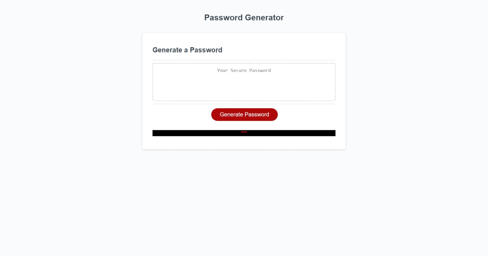

# Assignment 03:  Password Generator

## Description
This application is structured with HTML and styled with CSS to present a user with the ability to generate a secure password.  JavaScript is implemented to allow the user to generate and customize a secure password with lowercase, uppercase, numeric, and/or select special characters.  Atleast one of these criteria must be selected when the password is customized.  The generated password will have a minumum of 8 characters and no more than 128 characters.  The application is capabile of displaying on varied screen sizes.   

## Screenshots of webpage

## Webpage URL

[Password-Generator_Webpage_Live](https://djavanw.github.io/password_generator/)

## Contributor
D.J. Worthy

## License
The Unlicense

### Date
26 February 2021
